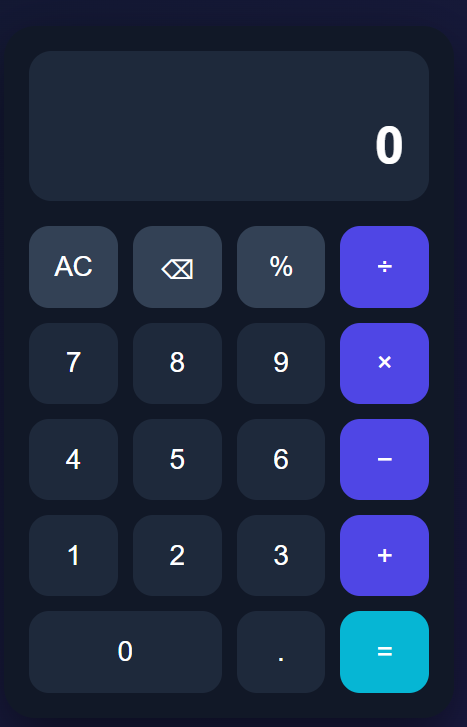

# 🧮 Smart Calculator

> A clean, modern and responsive calculator built with HTML, CSS and JavaScript.

---

## 🌐 Live Demo

🚀 **Try the calculator here:**

👉 https://syedzayarizvi.github.io/smart-calculator/

---

## 📸 About the Project

Smart Calculator is a beginner-friendly web project designed to provide
a simple and attractive calculator experience.

The project was created to practice **HTML structure, CSS styling and
JavaScript logic** while building a real-world interactive application.

---

## ✨ Features

- ➕ Addition
- ➖ Subtraction
- ✖️ Multiplication
- ➗ Division
- `%` Percentage calculation
- `AC` Clear all
- `⌫` Delete last digit
- ⚠️ Division-by-zero error handling
- 📱 Responsive design
- 🎨 Modern dark interface
- ⚡ Fast and lightweight
- 🖥️ Works on desktop and mobile

---

## 🛠️ Technologies Used

| Technology | Purpose |
|------------|---------|
| HTML5 | Website structure |
| CSS3 | Styling and responsive design |
| JavaScript | Calculator functionality |

---

## 📁 Project Structure

- `index.html` — Calculator structure
- `style.css` — Modern UI and responsive design
- `script.js` — Calculator logic and functionality
- `README.md` — Project documentation
- `assets/` — Images and screenshots

  ## 📸 Preview

